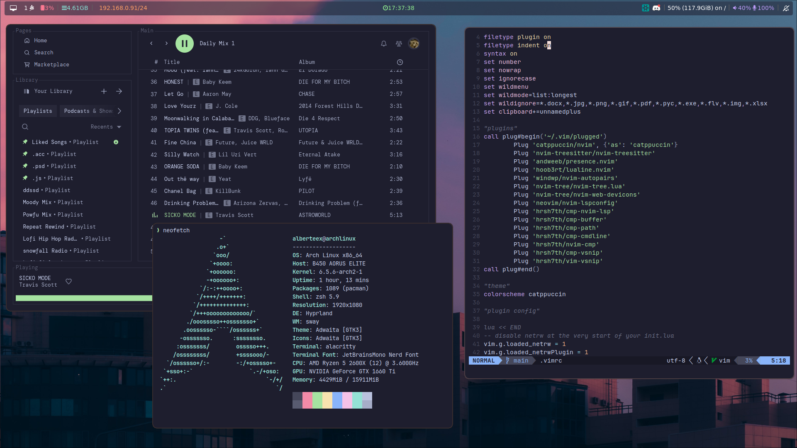
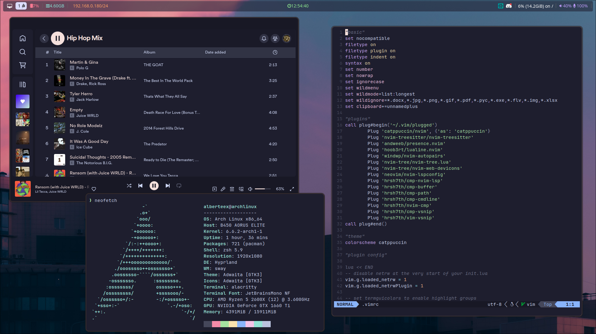

# Dotfiles

|  |  |
| --- | --- |

### Table of contents
* [Used Software](https://github.com/alberteex/dots/tree/main/assets#used-software)
* [Credits](https://github.com/alberteex/dots/tree/main/assets#credits)

### Used Software
* **Distro** - [archlinux](https://archlinux.org/)
* **WM** - [Hyprland](https://hyprland.org/)
* **Terminal** - [alacritty](https://github.com/alacritty/alacritty)
* **File Manager** - [nautilus](https://apps.gnome.org/Nautilus/)
* **Bar** - [waybar](https://github.com/Alexays/Waybar)
* **Launcher** - [wofi](https://github.com/uncomfyhalomacro/wofi)
* **Font** - [JetBrainsMono Nerd Font](https://www.jetbrains.com/lp/mono/)
* **Shell** - [zsh](https://www.zsh.org/)
* **Wallpaper** - [swaybg](https://github.com/swaywm/swaybg)

### Credits

